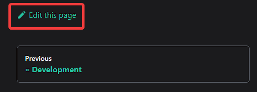
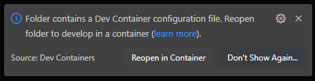
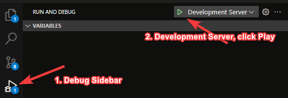

# Quickstart

ModifiedMC is open source, so everyone is welcome to contribute!

Cobblemon: PLUS! is the main pack for the ModifiedMC server network, but we have a number of variant packs that are maintained by the community for more customized experiences.

## Packs

Cobblemon: PLUS! is the main pack for the ModifiedMC server network, but we have a number of variant packs that are maintained by the community for more customized experiences.

### Cobblemon: PLUS!

[Curseforge](https://www.curseforge.com/minecraft/modpacks/modified-cobblemon-plus) | [GitHub](https://github.com/ModifiedMC/Cobblemon_Plus)

A currated Cobblemon with Create experience. Goal of the pack is to fuel like a more traditional Minecraft experience, but with a medieval fantasy experience using Create, Better Combat, TODO: improve description.

### Cobblemon: Essentials

[Curseforge](https://www.curseforge.com/minecraft/modpacks/modified-cobblemon) | GitHub (TODO) | Community Maintined!

A stripped down and minimalist Cobblemon experience. TODO: improve description.

### Cobblemon: Overclocked

[Curseforge](https://www.curseforge.com/minecraft/modpacks/modified-cobblemon) | GitHub (TODO) | Community Maintined!

A kitchen sink experience for Cobblemon loaded with all of the tech and magic you can imagine. TODO: improve description.

## Contributing

The easiest way to get contributing is to make issues and/or make this documentation better for everyone!

All of ModifiedMC's documentation, site, and modpacks are on [GitHub](https://docs.github.com/en/get-started/start-your-journey/about-github-and-git).

### What you'll need

- [GitHub Account](https://docs.github.com/en/get-started/start-your-journey/creating-an-account-on-github)
- A Code Editor — We recommend [VSCode](https://code.visualstudio.com/)

## Quick Edits

The fastest way to contribute can be done with no additional setup other then having a GitHub account and optionally a code editor with markdown preview support.

At the bottom of every page, you will see an "Edit this Page" link:



If you click this link, it will open the underlaying markdown file directly on GitHub. You can edit the markdown file there and then create PR to contribute the change back.

You can [Clone the repository](https://docs.github.com/en/repositories/creating-and-managing-repositories/cloning-a-repository) to your local and load it up in your local code editor.

You can find all of the [Markdown Features](https://docusaurus.io/docs/markdown-features) avaiable for editing.

## Development Server with Preview

The upside to quick edits is you do not need to install any extra tools, the downside is you cannot preview what the final result will look like. To be able to do that, you will need to install [Docker](https://docs.docker.com/get-started/get-docker/) and [Clone the repository](https://docs.github.com/en/repositories/creating-and-managing-repositories/cloning-a-repository).

Once you have docker installed and the repository cloned, open up the repoistory in your favorite Terminal and run `docker compose up`. You should see something similar to the following after it builds the local container:

```bash
$ docker compose up
[+] Running 1/1
 ✔ Container docs-site-docs-1  Recreated       11.6s
 Attaching to docs-1
docs-1  | [INFO] Starting the development server...
docs-1  | [SUCCESS] Docusaurus website is running at: http://localhost:3000/
docs-1  | [webpackbar] ℹ Compiling Client
```

You will now be able to open up a local copy of the site in your browser at http://localhost:3000/

## Full Development

If you want to be able to edit React templates and really take full advantage Docusaurus, you will likely need the full Node.js + react development environment setup. For that, you can set up the Node project however you feel most comfortable, but we recommend using [VSCode](https://code.visualstudio.com/) with a [Dev Container](https://marketplace.visualstudio.com/items?itemName=ms-vscode-remote.remote-containers).

1. Install [VSCode](https://code.visualstudio.com/) + the [Dev Container](https://marketplace.visualstudio.com/items?itemName=ms-vscode-remote.remote-containers) extension
2. [Clone the repository](https://docs.github.com/en/repositories/creating-and-managing-repositories/cloning-a-repository)
3. Open the repostory folder in VSCode, you should be prompted to reopen the folder to develop in a container, click "Reopen in Container"



Once you have the development container running, you have a full Node.js development environment. You can do any of your normal commands setup there, but if you want to get the development server running, you can run `yarn start` or you can use the Debug Task on the left to start the server


